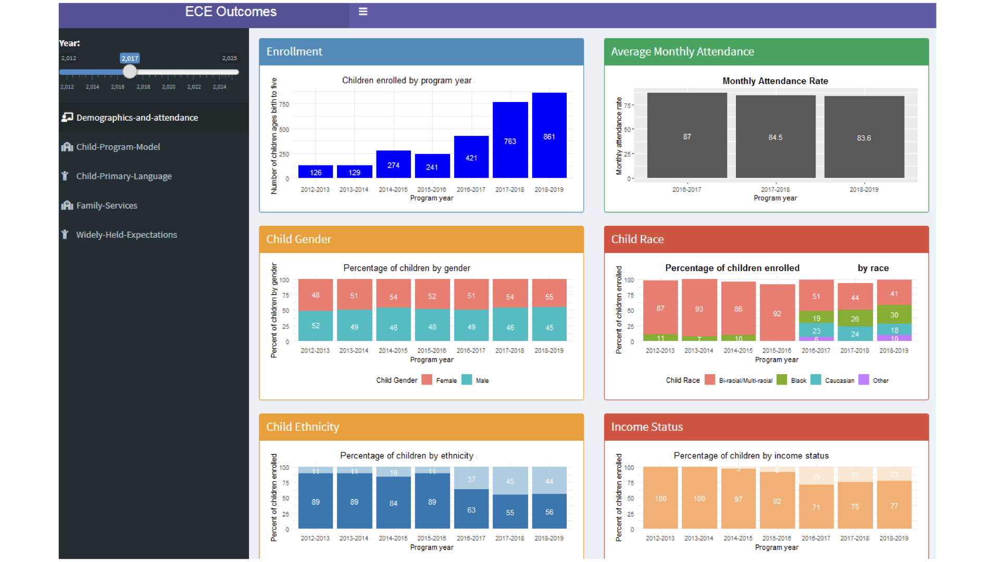
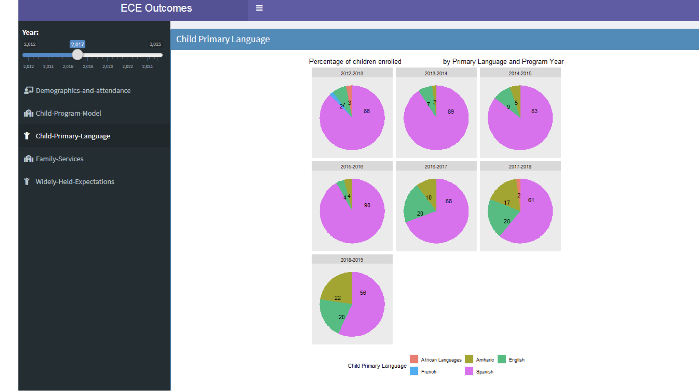
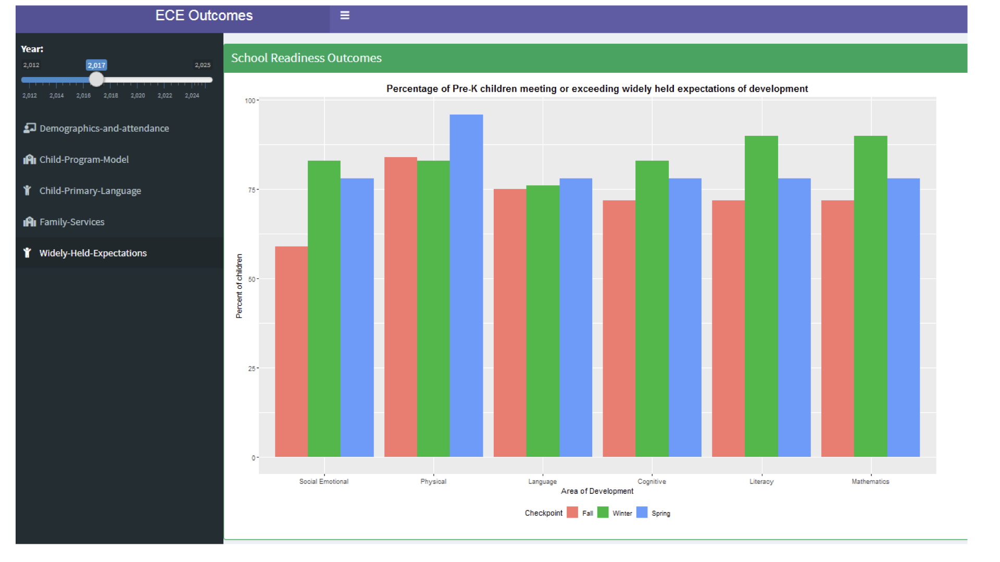

### Early Childhood Education Data Analysis

The purpose of this project was to develop an interactive dashboard using Shiny Dashboard in R Studio to monitor key performance measures of an early childhood education provider, and understand children's demographic characteristics, and their families' social services use across time.

Administrative data about early childhood education participants' at a community based organization of children's enrollment and demographic characteristics, family services received, and school readiness outcomes was used in this project, but cannot be disclosed in this project.

The summary data presented below demonstrates that over time, the number of children receiving early childhood education services has increased significantly, the share of female children has increased from the earliest time period in the data, 2012-2013, to the latest year of data available, 2018-2019, and racial, ethnic, and economic diversity has increased over time.

Over time, the community served demonstrates a large language diversity and an increasing share of children whose family language is Amharic at the end of 2018-2019, compared to other languages such as English and Spanish.

The data also demonstrated that this program benefited its participants served in Pre-Kindergarten programs. A higher share of children meet or exceed widely held expectations of development in areas such as social and emotional, physical, language, and cognitive development at the end of the school year or the spring term, compared to the fall term.

Overall, this early childhood education program served an increasing diverse population and met an increasing demand of quality child care services, while also supporting young children in developing healthy lifes.
